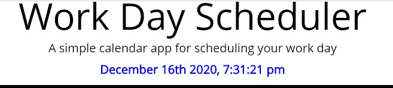

# Work Day Scheduler
## Description:
* ##### This is the Work Day Scheduler created with HTML/CSS with Jquery and Bootstrap.
 ---
 ## Table of Contents:
* [Features](#features)
* [Contribution](#contribution)
* [Credit](#credit)
* [License](#license)
 ---
 ## Features
 
 ## Here is the overview of the features in "Work Day Scheduler".
 1. ##### Depends on current time, it will divide the sections of each timeblock by three different colors:
    - ###### Past = Gray
    - ###### Present = Orange
    - ###### Future = Green

---
 

 2. ##### Using moment.js I was able to set current date, year, and time (colored in blue).

---
 

 3. ##### On each timeblock, you can type in whatever you want to write in, then once you click "save" button, it will keep the content inside each time block even after you refresh.
    - ###### In order to delete the content inside, you simply delete the content, then click "save" button, and refresh again at the end.
 ---
 ## Contribution:
 ##### Thank You:
- All of my classmates from the study group, TAs, tutor and the instructor from the Georgia Tech Boot Camp.
##### Be A Contributor!
- If you would like to contribute to the open source, here is the the link: <https://github.com/ahnlok/schedule-hw05>
---
## Credit:
Sungpil An <ansungpil1@gmail.com>
##### URL:
- GitPage:<https://ahnlok.github.io/daily-scheduler/>
- GitHubRepository:<https://github.com/ahnlok/schedule-hw05>
---
## License: 
© Sungpil An, Georgia Tech Coding Bootcamp

Licensed under the MIT License:
Copyright (c) [2020] [Sungpil An]

Permission is hereby granted, free of charge, to any person obtaining a copy of this software and associated documentation files (the "Software"), to deal in the Software without restriction, including without limitation the rights to use, copy, modify, merge, publish, distribute, sublicense, and/or sell copies of the Software, and to permit persons to whom the Software is furnished to do so, subject to the following conditions:

The above copyright notice and this permission notice shall be included in all copies or substantial portions of the Software.

THE SOFTWARE IS PROVIDED "AS IS", WITHOUT WARRANTY OF ANY KIND, EXPRESS OR IMPLIED, INCLUDING BUT NOT LIMITED TO THE WARRANTIES OF MERCHANTABILITY, FITNESS FOR A PARTICULAR PURPOSE AND NONINFRINGEMENT. IN NO EVENT SHALL THE AUTHORS OR COPYRIGHT HOLDERS BE LIABLE FOR ANY CLAIM, DAMAGES OR OTHER LIABILITY, WHETHER IN AN ACTION OF CONTRACT, TORT OR OTHERWISE, ARISING FROM, OUT OF OR IN CONNECTION WITH THE SOFTWARE OR THE USE OR OTHER DEALINGS IN THE SOFTWARE.